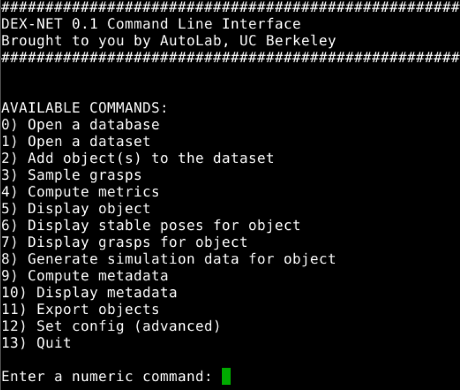
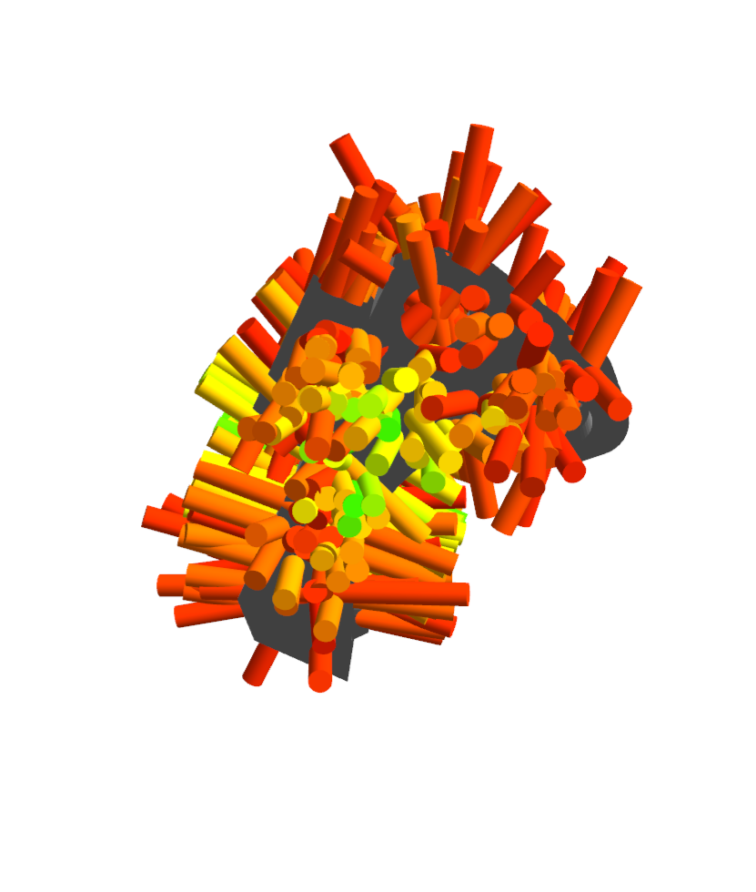

# Berkeley AUTOLAB's Dex-Net Package

## Installation Guide
### Install apt packages
```
# visualization
sudo apt install libspatialindex-dev python-rtree
```
### Install pip packages
```
pip install -r requirements.txt --user
```
### Install submodule library - dex-net dependencies
```
git submodule update --init --recursive
```
For each submodule - autolab_core, mayavi, meshpy, perception, visualization
```
python setup.py develop --user
```
For each submodule - Boost.NumPy, SDFGen
```
cd SDFGen
sudo sh install.sh

cd Boost.NumPy
sudo sh install.sh
```
## Quick Start
### Download Dataset
(1) First Download the example dataset provided by Dex-Net
```
wget -O example.hdf5 https://berkeley.box.com/shared/static/d8krg2p61xvt2pczxoyk0fqirbbflssu.hdf5
```
(2) RUN CLI command
```
python apps/dexnet_cli.py
```
You should see the following terminal output:



### Import Objects from given folders

Before Sampling Grasps on any objects from the example dataset (example.hdf5), you have to use command line to access its database by entering "0" and entering the path for example.hdf5. (If you enter a path/file which is not exist then the prompt will ask to create a new database). 

Each database can contains multiple dataset, and in `example.hdf5` there is only one dataset called `mini_dexnet`, and that is why when you open the example database, the program automatically open mini_dexnet as default. 

After you open a dataset, then you can do the following command depends, for example, add more objects into dataset, or sampling graps on objects inside the dataset.

### Import Objects from given folders
(1) SELECT "2"
(2) INPUT FOLDER PATH

You should see the program automatically import every objects in given folders the same file name.

<!-- 
 -->

### Sampling Grasps on a single object
(1) MODIFY `test/config.yaml` TO SET TARGET NUMBER OF GRASPS GENERATE ON OBJECT
(2) SELECT "3"
(3) PICK ONE OF OBJECTS TO SAMPLE GRASPS

TODO:
- Add one more function to sampling grasps for each objects inside the dataset.
- Save the grasps and metric result into numpy format into different files.

### Visualize Grasps
(1) SELECT "7"
(2) PICK ONE OF OBJECTS TO VISUALIZE

You should see the following result:



## Links
[Documentation](https://berkeleyautomation.github.io/dex-net/code.html)

[Project website](https://berkeleyautomation.github.io/dex-net)

[RSS Paper](https://github.com/BerkeleyAutomation/dex-net/raw/gh-pages/docs/dexnet_rss2017_final.pdf)

## Updates
As of Jan 1, 2018 the AUTOLAB visualization module uses the [trimesh](https://github.com/mikedh/trimesh) library instead of [meshpy](https://github.com/BerkeleyAutomation/meshpy).
Version mismatches between cloned libraries may lead to exceptions when using the CLI.
If you experience visualization errors, please run `git pull origin master` from the dex-net, meshpy, and visualization repositories and try again.

We are currently working on migrating dex-net to use [trimesh](https://github.com/mikedh/trimesh) and improving the installation procedure.
We hope to release a new version by May 2018.

## Overview
The dex-net Python package is for opening, reading, and writing HDF5 databases of 3D object models, parallel-jaw grasps, and grasp robustness metrics.

The HDF5 databases can also be used to generate massive datasets associating tuples of point clouds and grasps with binary grasp robustness labels to train [Grasp Quality Convolutional Neural Networks (GQ-CNNs)](https://berkeleyautomation.github.io/gqcnn) to predict robustness of candidate grasps from point clouds.
If you are interested in this functionality, please email Jeff Mahler (jmahler@berkeley.edu) with the subject line: "Interested in GQ-CNN Dataset Generation."

This package is part of the [Dexterity Network (Dex-Net)](https://berkeleyautomation.github.io/dex-net) project.
Created and maintained by the [AUTOLAB at UC Berkeley](https://autolab.berkeley.edu).

## Installation
See [the documentation](https://berkeleyautomation.github.io/dex-net/code.html) for installation instructions and API Documentation.

## Usage
As of Feb. 1, 2018, the code is licensed according to the UC Berkeley Copyright and Disclaimer Notice.
The code is available for educational, research, and not-for-profit purposes (for full details, see LICENSE).
If you use this code in a publication, please cite:

Mahler, Jeffrey, Jacky Liang, Sherdil Niyaz, Michael Laskey, Richard Doan, Xinyu Liu, Juan Aparicio Ojea, and Ken Goldberg. "Dex-Net 2.0: Deep Learning to Plan Robust Grasps with Synthetic Point Clouds and Analytic Grasp Metrics." Robotics: Science and Systems (2017). Boston, MA.

## Datasets
The Dex-Net Object Mesh Dataset v1.1 and Dex-Net 2.0 HDF5 database can be downloaded from [the data repository](http://bit.ly/2uh07i9).

Custom datasets can now be generated using the script tools/generate_gqcnn_dataset.py

## Parallel-Jaw Grippers
The repository currently supports our custom ABB YuMi gripper.
If you are interested in additional parallel-jaw grippers, please email Jeff Mahler (jmahler@berkeley.edu) with the subject line: "Interested in Contributing to the Dex-Net Grippers" with a description of the parallel-jaw gripper you'd like to add.

## Custom Database Generation
The master Dex-Net API does not support the creation of new databases of objects. 
If you are interested in using this functionality for research, see [the custom-databases branch](https://github.com/BerkeleyAutomation/dex-net/tree/custom-databases).
However, we cannot provide support at this time.